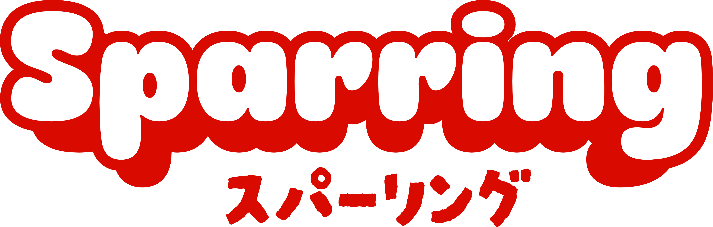
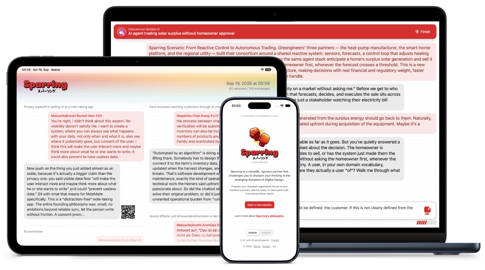

# Sparring

An exhibition object where you argue with an AI that doesn't hand you the answer. Try it out at [sparringmethod.com](https://sparringmethod.com).

<p align="center">
  
</p>

A QR code on the wall opens a text field on the visitor's phone. Whatever they
type goes to an AI that pushes back on the argument, and both sides of the
exchange are projected onto the wall behind them, so the whole room can watch
one person reason it through. The subject is Digital Design education. Sparring
was built for a master's thesis at FH Dortmund and shown for three days at
Superraum, Dortmund, in September 2026.

<p align="center">
  
</p>

## How it works

| Element | Path | What it does |
|---|---|---|
| **Dojo** (SE-01) | `/`, `/dojo` | Phone client. Start page, consent, then one session with a limited number of turns. |
| **Arena** (SE-02) | `/arena` | Wall display. Shows the latest exchanges from all sessions. |
| **Scenarios** | `/ses` | Picker for the sparring evaluation scenarios. Each one starts a dojo session on its own opening prompt (`/dojo?o=ses2` to `ses4`), the same way a printed QR code would. English only. |
| **Backend** (SE-03) | `/api/*` | Moderates each contribution, generates the reply and stores the session. |

The sparring behaviour comes from a single system prompt,
[`prompts/sparring.md`](prompts/sparring.md). On turn 1, the reply can draw on
a local curriculum corpus through SQLite FTS5.

**Stack:** PHP 8.2+, SQLite, vanilla JS. No framework and no build step.
Anthropic is the default LLM. OpenAI and OpenAI-compatible local models are
also supported, and an offline fake provider needs no API key.

## Quickstart

```sh
composer install
php bin/import_pilot.php
LLM_PROVIDER=fake php -S localhost:8080 -t public public/index.php
```

Open <http://localhost:8080> on the phone side and <http://localhost:8080/arena> for the wall. The fake
provider gives canned replies. For real ones, see
[Getting started](docs/getting-started.md).

## Documentation

- [Getting started](docs/getting-started.md): setup, LLM providers, tests, screenshots
- [Operations](docs/operations.md): export, database maintenance, deployment
- [Feature inventory](docs/features.md): everything the installation does
- [Design spec](spec/index.adoc): the design record of what the installation must do and why (L1–L3)
- [Architecture decisions](docs/adr/README.md): how the code is built and why
- [Prompt evals](evals/sparring/README.md): multi-turn evaluation of the sparring prompt
- [Changelog](CHANGELOG.md)

## Status

This is a thesis prototype built for a single exhibition run. It is not a
maintained product, but issues and questions are welcome.

## Acknowledgments

Parts of Sparring's teaching material are based on work originally written by
Dr. Kim Lauenroth.

Sparring uses the following open-source libraries and technologies:

- [ZzFX](https://github.com/KilledByAPixel/ZzFX) by Frank Force
- [qrcode-generator](https://github.com/kazuhikoarase/qrcode-generator) by Kazuhiko Arase
- [RethinkSans](https://github.com/hans-thiessen/Rethink-Sans/) by Rethink
- [Darumadrop One](https://fonts.google.com/specimen/Darumadrop+One) and [Mochi Boom](https://www.1001fonts.com/mochi-boom-demo-font.html), used in the Sparring logo
- [Material Design Icons](https://pictogrammers.com/library/mdi/) by the Pictogrammers group
- [EasyEngine](https://easyengine.io/)
- [SQLite](https://www.sqlite.org/)
- [Figma](https://figma.com/)
- [Claude API](https://github.com/anthropics/claude-api) and Claude Code

## License

[MIT](LICENSE)
