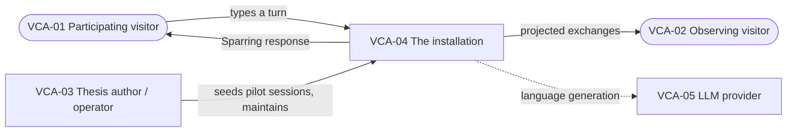

# L1 — Solution Design Concept

**Solution:** Sparring Exhibition Object
**Venue:** Superraum, Dortmund
**Author:** Sarah
**Status:** Draft
**Scope note:** Deliberately thin. This level exists to record *why* the installation is being built and what it must be true from a non-technical perspective. No L0 Digital Design Brief sits above it, so business constraints carry no `Refines → BRC-` relation. Those relations are omitted rather than pointed at IDs that do not exist.

---

## 1. Vision

### Executive summary (future press release)

**Dortmund, October 2026. Sparring goes public at Superraum.**

For three days at Superraum, visitors to the Sparring exhibition did not read about an AI that refuses to hand over answers. They argued with one. A QR code on the wall opened a plain text field on their own phone; whatever they typed went to a projected wall behind them, alongside the AI's reply, where everyone in the room could watch the exchange unfold.

"People expected it to just answer them," said Sarah, who designed the installation as part of her master's thesis at FH Dortmund. "Watching someone realise they were being pushed back on, and then watching them push back harder, was the whole point. That moment used to happen privately, in a session I had to reconstruct afterwards from a recording. Here it happened in a room full of people."

The installation ran unattended through opening hours. Visitors who arrived to an idle wall still found something to read, because sessions from earlier pilot runs kept the projection populated between live participants. Sessions started with a scan and ended when the visitor walked away, with no account, no app, and no name attached to anything on the wall.

Several visitors spent their session trying to talk the system out of its stance rather than working the problem with it. Those attempts stayed on the wall like every other exchange. "That is not misuse, that is the experiment," Sarah said. "If someone can talk the friction away in four turns in a gallery, that is a finding I would rather have than not."

The recorded sessions now sit alongside the thesis evaluation as a separate, lighter body of material: not a controlled study, but a public record of what happens when the friction meets people who did not sign up for a research session.

### Business goals

**BG-01 — Make Sparring's friction visible to an audience, not just to its user**
The installation shall put the exchange between learner and Sparring partner on a shared surface, so that the pedagogical mechanism is observable by people who are not the participant.
*Success criteria (qualitative):* A bystander who reads one projected exchange can tell that the AI declined to simply resolve the request.
*Rationale:* Legibility is a primary claim of the thesis. Until now it has only been evidenced through participant self-report after the fact.

**BG-02 — Give visitors direct, unassisted first-hand experience of being sparred with**
Any visitor shall be able to start and complete a session using only their own device, without installation, registration, or staff assistance.
*Success criteria (qualitative):* A visitor with no prior context reaches their first Sparring response without asking anyone how the piece works.

**BG-03 — Run unattended through exhibition hours**
The installation shall remain available and populated without an operator present, and shall degrade visibly rather than silently when something fails.
*Success criteria (quantitative):* Available for the full duration of published opening hours across the exhibition period, with no manual intervention required to restore the projected display.

**BG-04 — Produce a record of public interactions as secondary material**
Interactions shall be captured in a form that can be reviewed after the exhibition, clearly separated from the formal evaluation sessions.
*Success criteria (qualitative):* Exhibition-origin sessions are distinguishable from pilot and evaluation material without manual sorting.
*Rationale:* This is explicitly secondary. The installation is an exhibition artifact first. Treating the record as a research instrument would impose a rigor bar the piece is not designed to meet.

---

## 2. Value proposition

**VP-01 — Participating visitor**
*Segment characteristics:* Exhibition audience. Mixed background, largely non-expert in agentic AI. Attention measured in minutes, not hours. Arrives curious, not briefed.
*Value delivered:* Experiences the difference between an AI that resolves a request and one that holds a position. Sees their own thinking reflected back as something worth contesting. Leaves with a felt reference point rather than a description.
*Pains addressed:* Explanations of "productive friction" do not land as text on a wall panel. The concept is experiential and has, until now, required a scheduled session to convey.
*Current alternatives:* Reading a printed exhibition text about the thesis, or watching a recorded demo video.
*Satisfies:* BG-01, BG-02

**VP-02 — Observing visitor (bystander)**
*Segment characteristics:* Present in the room, not currently interacting. May be waiting, accompanying someone, or passing through. Engagement window of a few seconds.
*Value delivered:* Can read a complete exchange without context or commitment. Understands what the piece does before deciding whether to participate.
*Pains addressed:* Interactive pieces that only reward the person holding the device leave everyone else out of the work.
*Satisfies:* BG-01

---

## 3. Value creation architecture

**VCA-01 — Participating visitor** *(Customer)*
Receives the value described in VP-01. Interacts directly with VCA-04 through their own device.

**VCA-02 — Observing visitor** *(Customer)*
Receives the value described in VP-02 through the projected surface of VCA-04, without interacting.

**VCA-03 — Thesis author / operator** *(Organisation-internal)*
Provides the pilot session material that populates the installation before and between live sessions, and maintains the running system. Not present continuously during exhibition hours.

**VCA-04 — The installation** *(Digital-element)*
The whole technical system, treated as one element at this level. The technical decomposition into clients and backend belongs at L2.
*Interacts with:* VCA-01, VCA-02, VCA-03, VCA-05

**VCA-05 — LLM provider** *(Organisation-external)*
Supplies the language generation that produces Sparring responses. Not owned or controlled by the project.
*Realises:* VP-01

---

## 4. Information architecture

**BE-01 — Sparring session**
One visitor's continuous engagement with the installation, from first turn to abandonment or turn cap.
*Key information:* Origin (pilot or live), consent status, display eligibility, scenario label, start and last-activity time, turn count.
*Associations:* Contains many Exchanges (BE-02). Carries one Consent record (BE-04).

**BE-02 — Exchange**
One visitor turn together with the Sparring partner's reply to it. The exchange, not the individual turn, is the unit that carries meaning: a reply without its prompt shows nothing about friction.
*Key information:* Visitor contribution, Sparring contribution, position within the session, time.
*Associations:* Belongs to a Session (BE-01).

**BE-03 — Scenario**
A short statement of what a session is about, giving a reader enough context to make sense of an isolated exchange.
*Key information:* Summary text, derivation source (visitor's opening turn or generated label).
*Associations:* Describes one Session (BE-01).

**BE-04 — Consent record**
The visitor's decision about whether their session may be retained and reviewed after the exhibition.
*Key information:* Granted or withheld, time of decision.
*Associations:* Belongs to one Session (BE-01).

---

## 5. Business processes

### BP-01 — Visitor conducts a Sparring session

A visitor scans the code, agrees or declines to have their session retained, and exchanges turns with the Sparring partner until they stop or reach the session limit. Their exchanges appear on the projection as they happen.
*Frequency:* Continuously during opening hours, in bursts following visitor traffic.
*Involved parties:* VCA-01, VCA-04, VCA-05
*Creates / updates:* Creates Session (BE-01), Consent record (BE-04), Scenario (BE-03); creates Exchange (BE-02) per turn.
*Supports:* BG-01, BG-02

**Steps**

- **PS-01-1** Visitor scans the code and opens the session surface on their own device.
- **PS-01-2** Visitor is told what the installation does with their session and decides whether it may be retained.
- **PS-01-3** Visitor writes an opening contribution describing what they want to work on.
- **PS-01-4** The Sparring partner responds with challenge rather than resolution.
- **PS-01-5** The completed exchange becomes visible on the projection.
- **PS-01-6** Visitor and Sparring partner continue exchanging turns.
- **PS-01-7** Session ends when the visitor stops or the session limit is reached.

**Alternative flows**

- **PA-01-1** *(extends PS-01-2)* Visitor declines retention. The session runs normally and is not kept after the exhibition. *Outcome:* Alternative-success.
- **PA-01-2** *(extends PS-01-4)* The visitor's contribution is unsuitable for public projection. The session continues on the visitor's device and is withheld from the wall. *Outcome:* Alternative-success.
- **PA-01-3** *(extends PS-01-4)* Language generation is unavailable. The visitor is told plainly that the piece cannot respond right now. *Outcome:* Terminate.

**Note on scope.** A visitor who spends the session trying to argue the Sparring partner out of its stance is following BP-01, not deviating from it. This is deliberate and is not treated as an exception path.

### BP-02 — Recent sessions are shown to the room

The projection presents recent exchanges so that people who are not currently participating can read what the installation does. When no live session is running, earlier pilot material keeps the surface populated.
*Frequency:* Continuous.
*Involved parties:* VCA-02, VCA-04, VCA-03
*Creates / updates:* Reads Session (BE-01), Exchange (BE-02), Scenario (BE-03).
*Supports:* BG-01, BG-03

**Steps**

- **PS-02-1** The projection selects the most recent exchanges eligible for display.
- **PS-02-2** Each exchange is shown with the scenario that gives it context.
- **PS-02-3** New exchanges take prominence as they arrive; older ones recede.

**Alternative flows**

- **PA-02-1** *(extends PS-02-1)* No live sessions are available. Pilot material fills the surface instead. *Outcome:* Alternative-success.

---

## 6. Quality requirements

**BQR-01 — Visitors experience challenge, not obstruction** *(Customer-satisfaction)*
The friction shall read as deliberate and directed rather than as the system malfunctioning or refusing.
*Applies to:* BP-01, VP-01
*Acceptance criteria (qualitative):* In informal observation during the exhibition, visitors who encounter pushback continue the session rather than abandoning it at the first refusal.
*Satisfies:* BG-01

**BQR-02 — The piece is available whenever the room is open** *(Service-quality)*
*Applies to:* BP-01, BP-02
*Acceptance criteria (quantitative):* Available across published opening hours with no on-site intervention.
*Satisfies:* BG-03

**BQR-03 — Nothing identifying a visitor reaches the projection** *(Compliance)*
The public surface shall not carry names, contact details, or other personal information, whether typed deliberately or incidentally.
*Applies to:* BP-02, BE-02
*Acceptance criteria (qualitative):* Content assessed as carrying personal information is withheld from projection while the visitor's own session continues.
*Satisfies:* BG-01, BG-04

**BQR-04 — Exhibition material is never mistaken for evaluation data** *(Operational-excellence)*
*Applies to:* BE-01
*Acceptance criteria (qualitative):* Session origin is recorded at creation, not reconstructed afterwards.
*Satisfies:* BG-04

---

## 7. Constraints

**BC-01 — Build effort must not compete with thesis writing** *(Business)*
*Source:* Thesis delivery date, 10 September 2026.
*Applies to:* The whole solution.
*Acceptance criteria (qualitative):* The installation is scoped so that abandoning it entirely would not jeopardise the thesis.

**BC-02 — Public user-generated content is subject to data protection law** *(Legal-regulatory)*
*Source:* GDPR.
*Applies to:* BP-01, BP-02, BE-01, BE-04.
*Acceptance criteria (qualitative):* Retention is consented to, and projection of personal content is prevented independently of consent.

**BC-03 — One developer, no continuous on-site operator** *(Resource)*
*Applies to:* The whole solution.
*Acceptance criteria (qualitative):* No routine task requires a person in the room during opening hours.

**BC-04 — Display design is not yet settled** *(Organisational)*
The projected layout is marked TO BE REFINED and will be decided against real pilot transcripts on the actual projector.
*Applies to:* BP-02.
*Acceptance criteria:* TBC.

---

*Downward references ("implemented by", "realised by") are not written at this level. They are the reverse view of relations declared at L2 and L3.*
