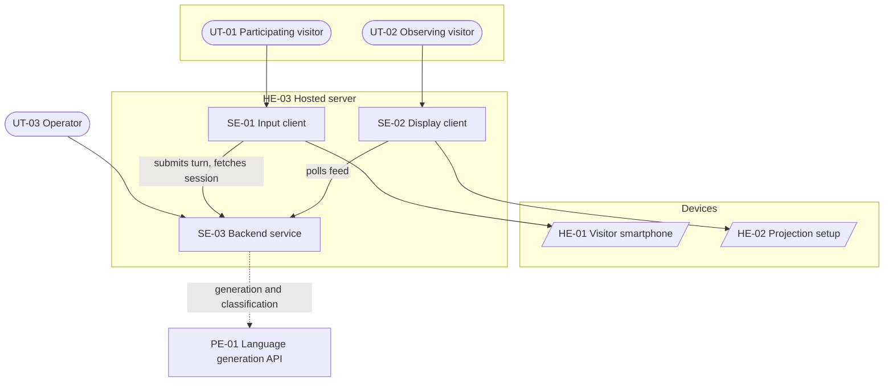

# L2 — System Design Concept

**System:** Sparring Exhibition Object
**Parent:** L1 Solution Design Concept
**Status:** Draft
**Scope note:** Deployment architecture (droplet sizing, web server configuration, TLS provisioning, backup scheduling) belongs in a separate System Realization Concept and is deliberately absent here.

---

## 1. System goals

**SG-01 — Start a session from a personal device with no installation or account**
The system shall let a visitor reach a working input surface by scanning a code, with no app, login, or staff assistance.
*Success criteria (qualitative):* From scan to first submitted turn requires no step other than consent and typing.
*Satisfies:* BG-02

**SG-02 — Make turn-taking readable from across the room**
The system shall present recent exchanges on a projected surface at a size and pacing that allows a standing observer to read a complete visitor contribution and its Sparring reply.
*Success criteria (qualitative):* A complete exchange is legible at typical viewing distance in the exhibition space. Exact typography and layout: TBC.
*Satisfies:* BG-01

**SG-03 — Survive interruption of the visitor's session**
The system shall let a visitor return to their session after a page reload, a locked phone, or a backgrounded browser, without losing prior turns.
*Success criteria (qualitative):* Reloading the input surface restores the session and its history.
*Satisfies:* BG-02
*Rationale:* Exhibition devices are fidgeted with. A session lost to a reload is indistinguishable in the record from a visitor who gave up.

**SG-04 — Run unattended and absorb misuse without operator intervention**
The system shall limit request volume per visitor, cap session length and input size, and continue functioning when individual requests are rejected.
*Success criteria (qualitative):* No failure mode requires someone in the room to restore the projection.
*Satisfies:* BG-03

**SG-05 — Record every interaction with its origin fixed at creation**
The system shall persist sessions and exchanges tagged as pilot or live at the moment they are created.
*Success criteria (qualitative):* Live exhibition material can be extracted without manual sorting.
*Satisfies:* BG-04

**SG-06 — Never present an empty surface**
When no live session is available for display, the system shall present pilot material instead.
*Success criteria (qualitative):* The projection is populated at all times while running.
*Satisfies:* BG-01, BG-03

**SG-07 — Gate public projection independently of session access**
The system shall be able to withhold a session from the projection while that session continues normally on the visitor's own device.
*Success criteria (qualitative):* A withheld session produces no visible interruption for its participant.
*Satisfies:* BG-01
*Rationale:* Supports BQR-03. Blocking projection and blocking use are different decisions and must not share a switch.

---

## 2. System architecture

### 2.1 Architecture overview

**Architecture style:** Client-server, three participants. Two thin browser clients and one stateful backend, with all logic and all credentials held server-side.

#### Key architecture principles

**AP-01 — All logic lives in the backend; clients are presentation only**
*Rationale:* The clients run on devices the project does not control, in a public setting. Placing generation, moderation, rate limiting, or session policy in a client would expose the API credential and make every rule editable by anyone with developer tools.
*Implications:* Rules out client-side calls to the language provider. Any behaviour change ships as a backend change, not a client change.
*Satisfies:* SG-04

**AP-02 — Polling, not push**
The projection asks the backend for current material on a fixed interval rather than holding an open connection.
*Rationale:* A projection refreshing every few seconds is indistinguishable from live at exhibition pace. A persistent connection is one more thing to keep alive across a multi-day unattended run, with reconnection logic that only manifests as a fault when nobody is watching.
*Implications:* Rules out server-sent events and websockets. Accepts a few seconds of latency between a turn completing and its appearance on the wall.
*Satisfies:* SG-04, SG-06

**AP-03 — Session identity travels in the URL; no accounts, no identity cookies**
*Rationale:* An identifier in the address survives reload, which is the specific failure this system is exposed to. Accounts would defeat SG-01, and identity cookies add a consent surface for no benefit.
*Implications:* Session identifiers are guessable-resistant but not secret. Rules out storing anything in a session that would be harmful if the URL were shared. Rules out any per-visitor authentication.
*Satisfies:* SG-01, SG-03

**AP-04 — One file-backed datastore, held inside the backend element**
*Rationale:* Exhibition-scale volume does not warrant a database server. A single file is copied to back up and inspected with one command, which matters when the maintainer is not on site.
*Implications:* Rules out concurrent write scaling. Accepts that the store has no independent design surface, so no separate element design document exists for it.
*Satisfies:* SG-04, SG-05

**AP-05 — Moderation gates projection, not access**
Content assessed as unsuitable withholds the session from the public surface. It does not end or degrade the visitor's own session.
*Rationale:* The public surface and the private interaction carry different risks. Ending someone's session because a classifier fired would punish the visitor for a system decision they cannot see.
*Implications:* Rules out treating moderation as an access control. Requires display eligibility to be a distinct stored property from consent.
*Satisfies:* SG-07

**AP-06 — Pilot and live material share one storage and display path, separated by an origin flag**
*Rationale:* A second path for pilot content would need its own rendering and its own failure modes. One path with one discriminating field is less code and makes the separation checkable.
*Implications:* Requires origin to be set at creation and never inferred. Any extraction of exhibition material must filter on it explicitly.
*Satisfies:* SG-05, SG-06

**AP-07 — Attempts to argue the Sparring partner out of its stance are in scope**
Content filtering addresses profanity, personal information, and material unrelated to the exercise. It does not address visitors trying to make the system abandon its position.
*Rationale:* Whether system-placed friction holds against a motivated user is the question the installation exists to expose. Filtering those attempts would remove the observation the piece is built to produce.
*Implications:* Rules out treating persuasion, pressure, or instruction-style attacks on the Sparring stance as abuse. Requires the moderation function to distinguish adversarial-but-engaged input from disengaged input, and this distinction must be stated in that function's specification rather than left to a wordlist.
*Satisfies:* SG-05

### 2.2 Architecture diagram

*Dashed link marks the system boundary. Detailed interaction sequences are in section 3, not in the diagram.*

### 2.3 System elements

#### User types

**UT-01 — Participating visitor**
An exhibition visitor who chooses to interact. No prior briefing, no expertise in agentic AI assumed, attention measured in minutes.
*Primary goals:* Find out what the piece does. Get a response to something they actually care about. Understand why the system is not simply answering them.
*Interacts with:* SE-01
*Represents:* VCA-01

**UT-02 — Observing visitor**
Present in the space, not interacting. May be accompanying a participant, waiting, or passing through.
*Primary goals:* Understand what the piece is without committing to it. Decide whether to participate.
*Interacts with:* SE-02 (viewing only, no input)
*Represents:* VCA-02

**UT-03 — Operator**
The thesis author. Seeds pilot material before the exhibition and intervenes only when something has failed.
*Primary goals:* Populate the installation before opening. Extract exhibition material afterwards. Diagnose a fault quickly and remotely.
*Interacts with:* SE-03
*Represents:* VCA-03

#### Software elements

**SE-01 — Input client** *(Web-application)*
The surface a visitor reaches by scanning the code, running in their own mobile browser.
*Key responsibilities:* Presents the consent decision before any input is possible. Accepts and submits visitor contributions. Displays the session's exchanges to its own participant. Restores an interrupted session from the identifier in the address. Signals that a response is being produced.
*Interacts with:* UT-01, SE-03, HE-01
*Realises:* VCA-04
*Satisfies:* SG-01, SG-03

**SE-02 — Display client** *(Web-application)*
The projected surface, running unattended in a browser on the projection machine.
*Key responsibilities:* Requests current display material at a fixed interval. Renders exchanges with the scenario that gives them context. Gives prominence to recent material and recedes older material. Fits content to the projection without overflow.
*Interacts with:* UT-02, SE-03, HE-02
*Realises:* VCA-04
*Satisfies:* SG-02, SG-06

**SE-03 — Backend service** *(Backend-service)*
The single stateful component. Holds the datastore internally (see AP-04), so no separate database element is identified.
*Key responsibilities:* Issues and resolves session identifiers. Produces Sparring responses by calling PE-01. Assesses contributions for projection suitability. Enforces request rate, input size, and session length limits. Persists sessions and exchanges with their origin. Assembles the material the projection displays. Accepts pilot material from the operator.
*Interacts with:* SE-01, SE-02, PE-01, UT-03, HE-03
*Realises:* VCA-04
*Satisfies:* SG-01, SG-04, SG-05, SG-06, SG-07
*Constrained by:* SC-01, SC-04

#### Hardware elements

**HE-01 — Visitor smartphone**
*Procurement:* Assumed-existing
*Managed by:* The visitor
*Runs:* SE-01
*Characteristics:* Any current mobile browser with camera-based code scanning. No minimum specification beyond this.

**HE-02 — Projection setup**
Projector and the machine driving it, running a browser in kiosk mode.
*Procurement:* TBC. Whether Superraum supplies the projector or it must be sourced is not yet confirmed.
*Managed by:* The venue or the operator, per the above.
*Location:* Fixed in the exhibition space. Throw distance and surface determine legible type size, which is why SG-02's acceptance criteria remain qualitative until tested in place.
*Runs:* SE-02
*Characteristics:* One projector, one display machine, wired network preferred over wireless for an unattended multi-day run.

**HE-03 — Hosted server**
*Procurement:* Managed-service
*Managed by:* Cloud provider
*Location:* EU region.
*Runs:* SE-01, SE-02, SE-03
*Characteristics:* Smallest generally available instance. Public HTTPS endpoint with a valid certificate, which is required because visitors reach it by scanning a code with a phone camera.

#### Partner elements

**PE-01 — Language generation API**
*Provider:* Anthropic
*Partner type:* Third-party-API
*Dependency:* Critical. The installation produces no Sparring response without it, and there is no degraded mode that preserves the piece's purpose.
*Used by:* SE-03

*Integration detail (authentication, request format, error taxonomy, retry policy) is specified in SE-03's outbound technical interfaces, not here.*

---

## 3. System scenarios

### SSc-01 — A visitor conducts a Sparring session
*Detail level:* Detailed
*Achieves:* SG-01, SG-03, SG-05, SG-07
*Realises:* BP-01

- **SSt-01-1** UT-01 scans the code and SE-01 opens without a session identifier. *(Performed by: UT-01; Affects: SE-01)*
- **SSt-01-2** SE-01 requests a new session from SE-03 and receives an identifier, which it places in the address. *(Performed by: SE-01; Affects: SE-03)*
- **SSt-01-3** SE-01 presents the retention decision and holds the input surface until UT-01 responds. *(Performed by: SE-01; Affects: UT-01)*
- **SSt-01-4** UT-01 submits a contribution to SE-03 through SE-01. *(Performed by: UT-01; Affects: SE-01, SE-03)*
- **SSt-01-5** SE-03 checks the request against its rate and size limits. *(Performed by: SE-03)*
- **SSt-01-6** SE-03 assesses the contribution for projection suitability and records the outcome against the session. *(Performed by: SE-03)*
- **SSt-01-7** SE-03 requests a Sparring response from PE-01, supplying the session's prior exchanges. *(Performed by: SE-03; Affects: PE-01)*
- **SSt-01-8** PE-01 returns the response to SE-03. *(Performed by: PE-01; Affects: SE-03)*
- **SSt-01-9** SE-03 stores the visitor contribution and the response as one exchange and returns the response to SE-01. *(Performed by: SE-03; Affects: SE-01)*
- **SSt-01-10** SE-01 presents the response to UT-01 and reopens the input surface. *(Performed by: SE-01; Affects: UT-01)*
- **SSt-01-11** The exchange becomes available to SE-02 on its next request, if the session is eligible for projection. *(Performed by: SE-03; Affects: SE-02)*

**Alternative flows**

- **SA-01-1** *(extends SSt-01-3)* UT-01 declines retention. SE-03 records the decision and the session proceeds; nothing is kept after the exhibition. *Outcome:* Alternative-success.
- **SA-01-2** *(extends SSt-01-5)* The request exceeds the rate or size limit. SE-03 rejects it and SE-01 tells UT-01 plainly. The session remains usable. *Outcome:* Resume.
- **SA-01-3** *(extends SSt-01-6)* The contribution is assessed as unsuitable for projection. SE-03 marks the session ineligible for display and continues the flow from SSt-01-7 without informing UT-01, per AP-05. *Outcome:* Resume.
- **SA-01-4** *(extends SSt-01-7)* PE-01 is unavailable or fails after retries. SE-03 returns a failure and SE-01 states that the installation cannot respond. *Outcome:* Terminate.
- **SA-01-5** *(extends SSt-01-4)* The session has reached its turn limit. SE-03 rejects the contribution and SE-01 presents the session as complete. *Outcome:* Terminate.
- **SA-01-6** *(extends SSt-01-1)* SE-01 opens with a session identifier already in the address after a reload. It fetches the existing session from SE-03 and resumes from SSt-01-4, skipping the retention decision. *Outcome:* Alternative-success.

### SSc-02 — The projection presents current material
*Detail level:* Narrative
*Achieves:* SG-02, SG-06
*Realises:* BP-02

SE-02 requests display material from SE-03 on a fixed interval. SE-03 assembles the most recent sessions eligible for projection, each reduced to a scenario statement and a bounded selection of its exchanges, and returns them ordered by recency. SE-02 compares the result against what it is currently showing and updates only what has changed, so that unchanged material does not visibly redraw. New exchanges take prominence; older ones recede. The exact treatment of prominence and recession is TO BE REFINED and is specified as an open decision in SE-02's element design.

**Alternative flows**

- **SA-02-1** *(extends the assembly step)* Fewer eligible live sessions exist than the projection can show. SE-03 fills the remainder with pilot-origin material, ordered by recency within its own group. *Outcome:* Alternative-success.
- **SA-02-2** *(extends the request step)* SE-02 cannot reach SE-03. It continues to display the last material it successfully retrieved rather than clearing the surface, and retries on the next interval. *Outcome:* Resume.

### SSc-03 — The operator seeds pilot material
*Detail level:* Narrative
*Achieves:* SG-05, SG-06

Before the exhibition opens, UT-03 supplies transcripts from pilot sessions to SE-03 in a structured file. SE-03 creates the corresponding sessions and exchanges with their origin fixed as pilot, derives a scenario statement for each, and marks them eligible for projection. This path performs no generation and does not call PE-01, because the responses already exist in the transcripts.

**Alternative flows**

- **SA-03-1** *(extends the creation step)* A transcript is malformed. SE-03 rejects that transcript, reports which one, and continues with the remainder. *Outcome:* Resume.

---

## 4. Quality requirements

**SQR-01 — A Sparring response arrives, or its absence is visible** *(Performance)*
*Applies to:* SE-01, SE-03, PE-01
*Acceptance criteria:* SE-01 presents an unambiguous in-progress state within 300 ms of submission and maintains it until a response or failure arrives. SE-03 abandons a generation request after a bounded interval rather than leaving the visitor with an indefinite wait. The bound is TBC pending measurement of real response times through PE-01.
*Supports:* BQR-01
*Rationale:* On a phone in a gallery, several seconds of nothing is read as broken. The in-progress state is not decoration.

**SQR-02 — The installation recovers without a person present** *(Availability)*
*Applies to:* SE-02, SE-03, HE-03
*Acceptance criteria (qualitative):* SE-02 recovers from a backend outage on its own next interval with no reload. SE-03 restarts automatically after a process failure. No fault requires physical access to HE-02 to clear.
*Supports:* BQR-02

**SQR-03 — The projection is readable at exhibition viewing distance** *(Usability)*
*Applies to:* SE-02, HE-02
*Acceptance criteria (qualitative):* A complete exchange is readable by a standing observer at the room's typical viewing distance. Verified in place on the actual projector before opening, not in a browser window.
*Supports:* BQR-01

**SQR-04 — Credentials and quota are protected from the public** *(Security)*
*Applies to:* SE-03
*Acceptance criteria:* The provider credential is never transmitted to any client. Request volume is limited per origin over a rolling window. Contribution length is bounded. Session length is bounded. Specific limits TBC pending a cost estimate against expected visitor volume.
*Externally sourced:* Yes (provider terms and cost exposure rather than a business quality requirement)

**SQR-05 — Origin is fixed at creation and never inferred** *(Data-integrity)*
*Applies to:* SE-03
*Acceptance criteria (qualitative):* Every session carries pilot or live from the moment it is created. No process assigns or corrects origin afterwards. Extraction of exhibition material filters on the stored value.
*Supports:* BQR-04

**SQR-06 — Public projection is governed separately from retention** *(Compliance)*
*Applies to:* SE-03, SE-02
*Acceptance criteria (qualitative):* Display eligibility and retention consent are stored as distinct properties and evaluated independently. A session may be retained and not projected, or projected and not retained.
*Supports:* BQR-03

**SQR-07 — The installation degrades visibly rather than silently** *(Reliability, recorded under Availability)*
*Applies to:* SE-01, SE-02
*Acceptance criteria (qualitative):* Every failure the visitor can encounter produces a plain statement of what happened. No failure presents as an unresponsive interface.
*Supports:* BQR-01

---

## 5. Constraints

**SC-01 — PHP with a file-backed store on a single hosted instance** *(Technical)*
*Source:* Operator's existing capability and maintenance preference.
*Applies to:* SE-03
*Acceptance criteria:* The system runs on one instance with no external database or queue service.
*Consequence:* Rules out horizontal scaling and any architecture requiring a message broker or separate database host.

**SC-02 — The public endpoint must be served over HTTPS with a valid certificate** *(Technical)*
*Source:* Mobile browser and camera-based code scanning behaviour.
*Applies to:* SE-01, SE-02, SE-03, HE-03
*Acceptance criteria:* A scanned code opens SE-01 without a certificate warning on current mobile browsers.
*Consequence:* Rules out serving from a bare IP address or a self-signed certificate.
*Externally sourced:* Yes

**SC-03 — Build effort is capped and the piece is expendable** *(Business)*
*Source:* BC-01.
*Applies to:* All software elements.
*Acceptance criteria (qualitative):* No element depends on infrastructure that would take more than a day to restore, and abandoning the installation entirely would not affect thesis delivery.
*Consequence:* Rules out an administrative interface, an analytics layer, and any build pipeline. Operator tasks are performed directly against the instance.
*Refines:* BC-01

**SC-04 — Generation is rate-limited and metered by the provider** *(Integration)*
*Source:* PE-01 provider terms.
*Applies to:* SE-03
*Acceptance criteria:* SE-03 handles provider rate-limit and quota responses as expected conditions rather than faults, and its own limits are set below the provider's.
*Consequence:* Rules out unthrottled request forwarding. Sets an upper bound on concurrent visitors, which is TBC.

**SC-05 — Retention requires consent; projection requires suitability** *(Legal-regulatory)*
*Source:* BC-02.
*Applies to:* SE-01, SE-03
*Acceptance criteria (qualitative):* No session is retained past the exhibition without a recorded decision, and no session reaches the projection without passing the suitability assessment.
*Consequence:* Rules out a single consent switch governing both retention and projection.
*Refines:* BC-02

**SC-06 — The projected layout is an open decision** *(Organisational)*
*Source:* BC-04.
*Applies to:* SE-02
*Acceptance criteria:* TBC. To be resolved against real pilot transcripts on HE-02 in the exhibition space.
*Consequence:* SE-02's element design specifies a baseline sufficient to build against and marks the layout treatment as TBC. SE-03's display interface must not encode assumptions specific to one layout.
*Refines:* BC-04

---

*Downward references from L3 are not written here. Element designs declare their own upward relations.*
