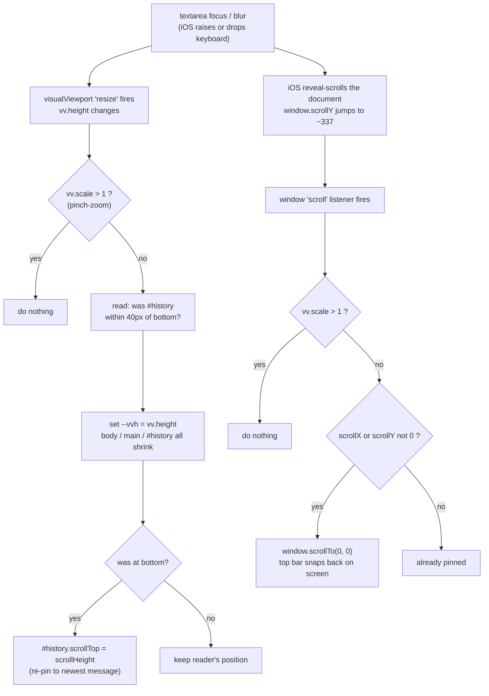

# The iOS software keyboard vs. the dojo layout

How `public/dojo.php` keeps its top bar, message history and composer in the
right place while the iOS Safari software keyboard is open, why the obvious
approaches don't work there, and how it was verified.

Touches: `public/assets/dojo.css` (`html`, `body`, `#history`),
`public/assets/dojo.js` (end of the IIFE), `public/dojo.php` (viewport meta).
Commits: `233e03d`, `21d79d6`, `2aeae37`.

---

## TL;DR

On iOS Safari the software keyboard **does not change any CSS-visible
height** — not the layout viewport, not `100dvh`, not `100vh`, not `%`. It
shrinks only `window.visualViewport.height`, and then it **reveal-scrolls
the whole document** upward to lift the focused `<textarea>` above the
keyboard. That document scroll is what pushes `#top-bar` off the top of the
screen; the un-shrunk `100dvh` body is what pushes the composer and the
newest messages *behind* the keyboard.

The fix is three cooperating pieces:

| # | Where | What |
|---|-------|------|
| 1 | `dojo.css` + `dojo.js` | `body { height: var(--vvh, 100dvh) }`; JS keeps `--vvh = visualViewport.height` |
| 2 | `dojo.css` | `#history { min-height: 0 }` so `flex: 1` can actually shrink it |
| 3 | `dojo.js` | a `window` `scroll` listener that snaps `scrollTo(0, 0)` — undoes iOS's reveal-scroll |

Plus a follow-up: re-pin `#history` to the bottom after the resize, and
guard everything on `visualViewport.scale > 1` so pinch-zoom is left alone.

---

## The three "viewports"

```
                     ┌─────────────────────────────────────────┐
   LAYOUT VIEWPORT    │  what CSS lengths resolve against:       │
   (a.k.a. ICB)       │  %, vh, and — on iOS — dvh too.          │
                      │  The iOS keyboard does NOT shrink this.  │
                      └─────────────────────────────────────────┘
                                       ▲ contains
                     ┌─────────────────────────────────────────┐
   VISUAL VIEWPORT    │  the part the user can actually see.     │
   window             │  Shrinks when the keyboard opens.        │
   .visualViewport    │  .height  → shrunk height                │
                      │  .offsetTop → how far it sits below the  │
                      │               layout-viewport top        │
                      └─────────────────────────────────────────┘

   window.scrollY  →  how far the document itself is scrolled.
                      iOS sets this on focus to reveal the field.
```

Key asymmetry, measured on iOS 26 (iPhone 17 Pro simulator, portrait):

| value | keyboard closed | keyboard open |
|-------|-----------------|---------------|
| `window.innerHeight` | 714 | 377 \* |
| `100dvh` / `100vh` / `100%` | **714** | **714** ← never moves |
| `window.visualViewport.height` | 714 | **377** ← the only one that tracks |
| keyboard height | 0 | ~337 |

\* `innerHeight` shrank in the iOS 26 sim (from the `interactive-widget`
meta) but **no CSS unit followed it**, so it can't be used for layout. On
the physical test device even `innerHeight` stays 714.

---

## State A — keyboard closed

`body` is `100dvh` = 714. The flex column fills it exactly. `#history`
(`flex: 1`) takes the slack and scrolls internally.

```
 glass 0 ┌───────────────────────────────┐ ─┐
         │ #top-bar            (~52px)    │  │
         ├───────────────────────────────┤  │
         │ #history  flex:1               │  │  html, body: height 100dvh = 714
         │   ├ turn 18                    │  │  main: height 100%  = 714
         │   ├ turn 19                    │  │  overflow: hidden on html/body
         │   ╰ turn 20   ◄── scrollTop    │  │  → the page itself cannot scroll
         │        at bottom               │  │     window.scrollY = 0
         ├───────────────────────────────┤  │
         │ #composer          (~96px)    │  │
   714 └─┴───────────────────────────────┴─ ┘
```

---

## State B — keyboard open, **no fix** (what iOS does by itself)

`visualViewport.height` drops to 377. `100dvh` stays 714, so `body`/`main`
stay 714 — now taller than the 377 the user can see. That makes the
document scrollable, and iOS scrolls it up by ~337 to get the focused
composer above the keyboard.

```
                 ┌───────────────────────────────┐
   layout-y -337 │ #top-bar        ◄── scrolled   │   OFF SCREEN
                 │                     off the top│
   glass 0 ══════╪═══════════════════════════════╪══ visualViewport top
                 │ #history (still tall)          │   window.scrollY   = 337
                 │   ├ turn 15                    │   visualViewport
                 │   ├ turn 16                    │     .offsetTop      = 337
                 │   ╰ turn 17  ◄── scrollTop     │     .height         = 377
                 │        337px SHORT of bottom   │   body/main height  = 714
                 ├───────────────────────────────┤
                 │ #composer   ◄── iOS lifted     │
                 │             this into view     │
   glass 377 ════╪═══════════════════════════════╪══ keyboard top
                 │██████████  KEYBOARD  ██████████│
                 │████████ (~337px tall) █████████│
   glass 714 ════╧═══════════════════════════════╧══
```

Two separate symptoms, one root cause (`body` never shrank):

- **Top bar gone** — the document reveal-scroll (`scrollY 337`) carried it
  above `glass 0`.
- **History scrolled short** — `#history` kept its old pixel `scrollTop`,
  but shrinking its viewport pushed the "bottom" 337px further down.

`html, body { overflow: hidden }` does **not** stop the reveal-scroll on
iOS. `position: fixed` / `sticky` on the bar or composer does **not** help
— both are measured from the layout viewport, which the keyboard never
touched; a `fixed` composer at `bottom: 0` lands *behind* the keyboard.

---

## State C — keyboard open, **with the fix**

```
   glass 0 ┌───────────────────────────────┐ ─┐
           │ #top-bar        ◄── held       │  │  JS: --vvh = visualViewport.height = 377
           ├───────────────────────────────┤  │  body: height var(--vvh) = 377
           │ #history  flex:1, min-height:0 │  │  main: height 100%        = 377
           │   ├ turn 18                    │  │  #history shrinks with the column
           │   ├ turn 19                    │  │  → main never overflows body
           │   ╰ turn 20  ◄── re-pinned     │  │  → nothing to reveal-scroll
           │        to the bottom           │  │
           ├───────────────────────────────┤  │  window "scroll" listener:
           │ #composer       ◄── above kb   │  │    scrollY drifts → scrollTo(0,0)
   glass 377 ┴───────────────────────────────┴─ ┘    → scrollY stays 0, bar stays put
           │██████████  KEYBOARD  ██████████│
   glass 714 ═══════════════════════════════════
```

Measured after the fix, all scenarios (focus / scroll-then-focus /
blur-scroll-refocus): `scrollY 0`, `visualViewport.offsetTop 0`, `main`
height 377 at `top 0`, top bar visible, composer visible, `#history` flush
with the last bubble.

On keyboard **dismiss**: the `resize` fires again, `--vvh` goes back to
714, everything restores — `main` 714 at `top 0`, no leftover offset, no
dead strip.

---

## The mechanism, box by box

| box | rule | why |
|-----|------|-----|
| `html, body` | `overflow: hidden` | the page as a whole must never scroll — `#history` is the only scroller. Also the precondition that makes the `scrollTo(0,0)` lock safe (there is no legitimate page scroll to fight). |
| `body` | `height: var(--vvh, 100dvh)` | `--vvh` (JS, = `visualViewport.height`) is the only value that shrinks for the iOS keyboard. `100dvh` is the fallback when there is no `visualViewport` (old engines) or before JS runs. |
| `main` | `height: 100%` (unchanged) | 100% of `body`, so it inherits the `--vvh` height. |
| `#history` | `flex: 1; min-height: 0` | `flex: 1` gives it the slack. **`min-height: 0`** is load-bearing: a flex item's default `min-height` is `auto` (= content height), so without this `#history` refuses to shrink, `main` overflows the shortened `body`, and iOS reveal-scrolls the page — the exact thing we're removing. |
| `#history` | `overscroll-behavior-y: contain` | reaching its top/bottom doesn't chain-scroll anything behind it. |
| `#composer` | (normal flow, bottom of the column) | no `position: fixed` — fixed is measured from the layout viewport and would sit behind the keyboard. As a flex child at the end of a `--vvh`-tall column it lands just above the keyboard for free. |

### JS (end of the `dojo.js` IIFE)

```js
var vv = window.visualViewport;
if (vv) {
    var publishViewportHeight = function () {
        if (vv.scale > 1) return;                 // leave pinch-zoom alone
        var wasAtBottom =
            historyEl.scrollHeight - historyEl.scrollTop - historyEl.clientHeight < 40;
        document.documentElement.style.setProperty('--vvh', vv.height + 'px');
        if (wasAtBottom) historyEl.scrollTop = historyEl.scrollHeight;  // re-pin
    };
    vv.addEventListener('resize', publishViewportHeight);
    publishViewportHeight();

    window.addEventListener('scroll', function () {
        if (vv.scale > 1) return;
        if (window.scrollX || window.scrollY) window.scrollTo(0, 0);    // undo iOS reveal-scroll
    }, { passive: true });
}
```



---

## What was tried and rejected

| approach | why it failed on iOS Safari |
|----------|-----------------------------|
| `position: sticky` on `#top-bar` | sticky tracks the layout viewport; the keyboard shifts the visual viewport → bar still leaves |
| `position: fixed` on `#top-bar` + `#composer`, `#history` the only flow element | fixed is measured from the layout viewport → composer pins **behind** the keyboard; fixed also jitters/detaches during iOS keyboard transitions |
| `interactive-widget=resizes-content` meta alone | Chrome Android honours it; the iOS test device logs *"Viewport argument key interactive-widget not recognized"* and ignores it. Kept anyway — it is the real fix on Android, no cost on iOS. |
| `height: 100dvh` / `svh` / `%` | none shrink for the iOS keyboard |
| `--vvh` height **without** the scroll lock | sized correctly but iOS's leftover `scrollY` still dragged the bar off; felt "sluggish / unpredictable" because it flapped on every `resize` during the keyboard animation |
| `#contribution:focus { animation: <0.01s opacity> }` ("blink hack") | meant to suppress the reveal-scroll; did not, once `#history` was scrolled |
| reactive handlers chasing `visualViewport.offsetTop` / `scrollY` | iOS fires `resize` / `scroll` on inconsistent beats; on a warm re-focus `offsetTop` and `scrollY` move on separate frames → always a frame behind |

---

## How it was verified

There is no CI for layout and Playwright's WebKit has no software keyboard,
so this was checked by driving the **Xcode iOS Simulator from the shell**:

```sh
# one-time: make the on-screen keyboard appear for programmatic .focus()
defaults write com.apple.iphonesimulator ConnectHardwareKeyboard -bool false

UDID=$(xcrun simctl list devices booted | grep -oE '[0-9A-F-]{36}')
php -S 127.0.0.1:8899 -t public            # serve the app
xcrun simctl openurl "$UDID" "http://127.0.0.1:8899/dojo"
xcrun simctl io "$UDID" screenshot shot.png
```

A throwaway `public/kbtest.php` harness (deleted after) rendered the real
`dojo.css` against a dojo-shaped DOM with a `position: fixed` on-screen
readout of `visualViewport.height / offsetTop`, `window.scrollY`,
`#history.scrollTop` and `main.getBoundingClientRect()` — translated by
`offsetTop` so the numbers stayed visible even in the broken state, with no
Web Inspector. Scenarios screenshotted: plain focus, scroll history to
bottom then focus, focus/blur/scroll/refocus, and keyboard dismiss, each
across every candidate fix. Reading the live numbers
(`mainH 714 top -337` while `innerH 377`) is what pinned the root cause.

---

## Testing checklist (physical iOS device)

1. **At rest** — composer at the bottom, no gap under it, top bar in place,
   `#history` scrolls its own messages, a swipe outside `#history` does not
   scroll the page.
2. **Focus the composer** — top bar holds, composer sits just above the
   keyboard, `#history` scrollable in the band between.
3. **Many messages, scroll to bottom, then focus** — newest message stays
   flush above the composer (does not jump up ~a keyboard-height).
4. **Send a message, then re-focus** — same as 2, no manual swipe needed.
5. **Dismiss the keyboard** — layout returns to the rest state, no leftover
   offset or dead strip.
6. **Pinch-zoom** still works and does not shrink the app.
7. **Chrome Android** — keyboard open, composer + history above it (via the
   `interactive-widget` meta), no regression.
